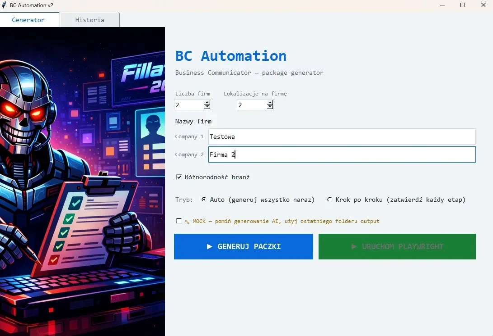
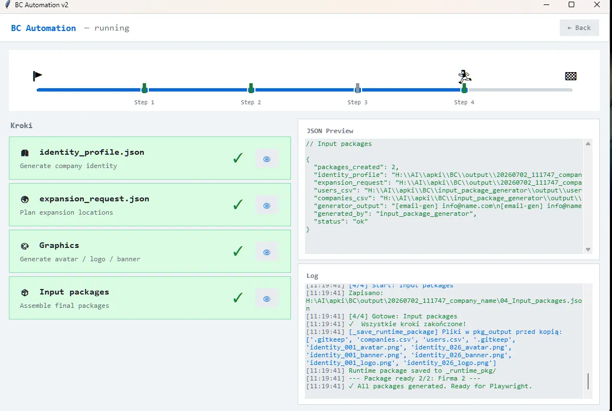

# BC Portal Automation Suite

**Three tools built for the Business Communicator portal**


*BC Automation input form with test data entered ("Testowa" / "Firma 2").*


*BC Automation after a completed run: all four steps green-checked, "Wszystkie kroki zakończone!", packages ready.*

---

Business Communicator (`business-communicator.com`) is a B2B networking platform where companies create profiles, connect with partners, and publish content. These tools automate repetitive account-lifecycle and engagement workflows on that portal — tasks that would otherwise require hours of manual clicking per batch. This repository is a sanitized portfolio version: all real credentials, account data, and private URLs have been removed and replaced with environment variables and example files.

## Tool 1: BC Automation (Python)

**Status:** in development

Automates the account lifecycle on the portal: generates company/user identities, fills user profiles, and completes company setup.

- Generates company identities end-to-end using OpenAI — GPT-4o-mini for text, gpt-image-1 for images
- Fills user profiles (bio, avatar, location)
- Creates company entries (name, logo, banner, description) and completes the second setup step (map pin, plan upgrade)
- Packages inputs for batch runs; ships as a Windows desktop app (GUI launcher built with tkinter, distributable via PyInstaller + Inno Setup)

**Note on registration:** the portal added a CAPTCHA to its registration step, so automatic user registration through this tool no longer works. Data generation and profile/company filling are unaffected — the operator now registers each account manually on the portal, using the account data this tool generated, and drives that manual step (plus any other manual fixes) through [BC Manual Runner](#tool-2-bc-manual-runner-python) below.

**Stack:** Python, Playwright, OpenAI API, tkinter, PyInstaller, Inno Setup

**Setup**

```powershell
python -m venv venv
venv\Scripts\activate
pip install -r requirements.txt
playwright install chromium

copy .env.example .env
# edit .env: set OPENAI_API_KEY and the BC_*_URL values
```

**Usage**

```powershell
python src/gui_app_v2.py
```

This opens the desktop GUI launcher, which drives the profile → company setup flow using the inputs in `examples/` (or your own input package generated by `src/input_package_generator/`). Registration is now performed manually — see BC Manual Runner below.

Source: [`src/`](src/)

## Tool 2: BC Manual Runner (Python)

**Status:** in development

A small companion GUI to BC Automation. It loads a generated `_runtime_pkg` folder (`companies.csv`, `users.csv`, avatar, logo, banner) and exposes one button per registration/profile-fill step, so each step can be triggered by hand instead of running as part of the automated pipeline.

It exists for two reasons:

- **Manual registration:** since automatic registration now requires solving a CAPTCHA (see the note in Tool 1), the operator registers each account by hand on the portal, then uses this tool to run the remaining steps against the same generated data.
- **Ad-hoc fixes:** it lets an operator re-run or complete individual steps — registration, profile fill, company step 1, company step 2 — that the main GUI didn't finish correctly or skipped, without re-running the full pipeline.

Buttons: **Register Users**, **Fill User Profiles**, **Fill Company (step 1)**, **Fill Company Step 2** — each copies the loaded CSV/image data into place and runs the corresponding script (`register.py`, `fill_profile.py`, `fill_company.py`, `fill_company_step2.py`).

**Stack:** Python, Playwright, tkinter

**Usage**

```powershell
python src/manual_runner.py
```

Source: [`src/manual_runner.py`](src/manual_runner.py)

## Tool 3: BC Follow Bot (TypeScript)

**Status:** in development, actively extended

Automates engagement and AI-assisted content operations on the portal, with a strong emphasis on human oversight and auditability.

- Batch-follows profiles across multiple accounts with per-account rate limits, skip-existing logic, and a full audit trail (CSV-driven)
- Generates AI content drafts via the OpenAI API, routes them through human CSV approval, and gates any publish action behind a dry-run step plus two typed confirmations
- Normalizes AI draft text before approval export and flags uncertain or suspicious language for human review
- Includes an operator batch draft preparation flow: multiple profile-aware AI draft posts can be prepared for review while human approval, browser execution, and real publishing stay separated and controlled
- Runs a publish target preflight before manual publish: `profile_url` targets, account context, and current target URL are checked where available, with operator warnings when active portal identity can't be verified automatically
- Has passed real one-post supervised content runs, including a full operator batch flow: AI draft generation, human review, approval CSV, publish plan, browser dry-run, manual publish, portal verification, and audit review
- 26 unit test suites covering core logic and edge cases; also served as a de-facto regression harness during development, surfacing real UI/integration bugs
- Strict TypeScript throughout

**Stack:** TypeScript, Node.js, Playwright, OpenAI API

Source: [`bc-follow-bot/`](bc-follow-bot/) — see its [README](bc-follow-bot/README.md) for setup and usage.

## Case Studies

Short write-ups of real problems encountered during development:

- [CSV Multiline Content Approval Fix](CASE_STUDY_CSV_MULTILINE_CONTENT_APPROVAL_FIX.md) — diagnosed and fixed a silent data-corruption bug caused by unescaped newlines breaking CSV parsing in the content approval pipeline
- [AI Content Quality Gate](CASE_STUDY_AI_CONTENT_QUALITY_GATE.md) — shifted the supervised content workflow from "does it technically run?" to "is the AI output actually good enough to approve?", with later draft normalization and language-review flags before human approval
- [Supervised Content Run 002](CASE_STUDY_SUPERVISED_CONTENT_RUN_002.md) — end-to-end verification that the full human-gated content workflow completes reliably for a single manually approved post, with a later language-QA run confirming normalized drafts and manual portal verification
- [Operator Batch Content Run 001](CASE_STUDY_OPERATOR_BATCH_CONTENT_RUN_001.md) — a Stage 60 run showing that operator batch input can feed AI draft generation, manual approval, browser dry-run, guarded one-post publish, portal verification, and audit review without enabling batch publishing

## Portfolio Note

This is a sanitized portfolio version. Real credentials, portal URLs, approved post text, logs, browser state, cookies, and all account-identifying data have been stripped. Configuration is passed via environment variables (`.env`); safe example files are in [`examples/`](examples/).

All three tools are under active development.
