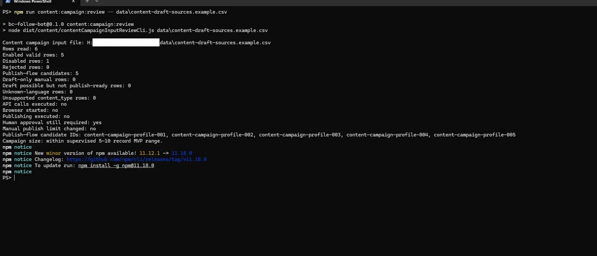

# BC Follow Bot

**Status:** in development, actively extended

A local Windows 11 automation tool for controlled internal portal activity: follow automation, profile discovery, and a full supervised AI content publishing pipeline — all built on TypeScript, Node.js, and Playwright.


*`npm run content:campaign:review` against example CSV data — a safe, read-only pre-flight check. Row counts and publish-flow candidate IDs are computed with no API calls, no browser started, and no publishing executed. Local file path redacted.*

## What it does

BC Follow Bot automates three distinct, independently gated workflows on an authorized internal business portal:

**1. Follow automation**
Logs into multiple accounts, navigates to person profiles by URL, clicks Follow, and classifies the result (`followed` / `already_following` / `not_found` / `login_failed` / `follow_failed`). Skips company pages. Maintains a local action-history file to avoid repeating already-processed targets. Exports structured CSV results per run.

**2. Supervised AI content pipeline**
Generates post drafts via an OpenAI-compatible API, then walks the operator through a multi-stage approval flow before publishing anything:

```
AI draft generation → human approval CSV → approval review → publish plan
  → browser dry-run → manual-confirm publish (two explicit confirmations)
  → private run audit
```

No content is published without human sign-off at every gate. The two final confirmations (`PUBLISH_CONTENT_YES` and `FINAL_PUBLISH_YES`) must be typed manually at the terminal.

Before real manual publish, a preflight check also runs: the publish row must use `target_type=profile_url`, include a target profile URL, match the selected account context, and stay on the expected target URL after navigation when that signal is available. If the active portal profile can't be fully verified automatically, the operator is warned to check the account/profile manually before final confirmation.

**3. Profile discovery**
Searches for person profiles on the portal and exports found profile URLs as a target list for the follow run.

## Key features

- **Defensive browser automation** — checks page state before acting, handles missing or changed selectors gracefully, logs all UI differences
- **Strict approval gates** — generated content cannot reach publishing without explicit human approval at every stage; `pending`, `rejected`, and `needs_changes` records are blocked
- **Draft normalization and language QA flags** — AI draft text is cleaned before approval export, and uncertain or suspicious language is marked for human review
- **Per-run and per-account limits** — configurable safety caps enforced before any browser action; large runs require a typed `YES` to proceed
- **Local action history** — skips already-followed targets; avoids duplicating successful work
- **Audit trail** — every run exports structured CSV results; a private local file tracks real publish history for scale decisions
- **Campaign input review** — pre-flight check for 5–10 record supervised campaigns before any AI API calls are made
- **Incidental regression coverage** — not built as a test tool, but running this against the live portal UI has repeatedly surfaced real UI and integration bugs (changed selectors, broken flows) before they reached a supervised publish

## Tech stack

| Layer | Technology |
|-------|-----------|
| Language | TypeScript 5 (strict mode) |
| Runtime | Node.js |
| Browser automation | Playwright |
| AI drafts | OpenAI-compatible REST API (local key only, never committed) |
| Data | CSV inputs/outputs, JSON config |
| Build | `tsc` → `dist/` |
| Tests | 26 unit test suites (Node built-in `assert`, `.cjs`) |

## How to run

```powershell
# 1. Install dependencies
npm install

# 2. Copy example files to local config (excluded from Git)
Copy-Item config\appsettings.example.json config\appsettings.json
Copy-Item data\accounts.example.csv data\accounts.csv
Copy-Item data\targets.example.csv data\targets.csv

# 3. Build
npm run build

# 4. Follow run
npm start

# 5. Discovery
npm run discovery
```

### AI content pipeline

```powershell
npm run content:generate:drafts          # generate drafts via AI API
npm run content:approval:review          # review operator-approved CSV
npm run content:publish:plan             # build publish plan (gated)
npm run content:publish:browser-dry-run  # verify targets without publishing
npm run content:publish:manual-confirm   # publish one post after two confirmations
```

### Supervised campaign

```powershell
npm run content:campaign:review        # pre-flight input check, no API/browser
npm run content:audit:review           # review local private audit history
```

## Project structure

```
src/
  auth/          Login flow with robust email/password field handling
  bootstrap/     Startup validation and run gating
  content/       Full AI content pipeline (15 modules)
  discovery/     Profile search, matching, and target export
  follow/        Follow action with result classification
  input/         CSV and config loading with strict validation
  runner/        Orchestration, preflight checks, result export
  search/        Profile navigation and page classification
  logs/          Structured file logging
  shared/        Shared types, config, CSV utilities
  state/         Local profile action history
test/            26 unit test suites (.cjs, Node built-in assert)
```

## Case studies

Engineering case studies from this project are documented in the companion `bc-automation-portfolio` repository:

- **CSV multiline approval fix** — handling multi-line `approved_text` fields across the approval → plan → publish pipeline without breaking row integrity
- **AI content quality gate** — systematic evaluation of AI-generated post drafts before supervised publishing: what "usable" means in practice
- **Draft normalization and language review flags** — cleaning empty draft paragraphs and marking uncertain language before human approval
- **Supervised content run status** — a real one-post supervised run passed language QA, kept human approval mandatory, published only after manual confirmation, and was manually verified in the portal

## Portfolio note

This is a sanitized snapshot. Real portal URLs, account credentials, operator-specific data, and production configuration have been replaced with safe examples. The application is built for local, single-operator, authorized internal use on a specific business portal — not for mass automation or public deployment.

Security model: real secrets live only in local `.env` and `config/appsettings.json` (both Git-ignored). No credentials are committed. The AI API key is read from `CONTENT_AI_DRAFT_API_KEY` in `.env`.
